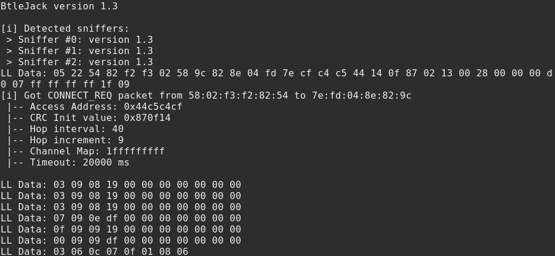

## Playing with btlejack

Recently I found out about `btlejack`, what seems to be a great tool for BLE sniffing. This piece of text is about how I got familiar with it and it can also serve as a demonstration of `btlejack` capabilities. Generally, `btlejack`'s official [github page](https://github.com/virtualabs/btlejack) provides very good overview of the tool, so be sure to check it out. 

### Sniffing

With `btlejack`, one has two possibilities on how to sniff BLE. First option is to wait for new connection to be established and sniff on all the connection parameters necessary for sniffing that are exchanged in plain text during the connection establishment. The second possibility is to listen to ongoing connections and derive the parameters for sniffing from the traffic. 

##### Sniffing for new connections

To sniff for new connections, you can choose if you want to filter connections **to** specific device, or to any of the devices. In the former case you need to know device's `BD_ADDR`, in latter, you can just type `any` instead of this address. In both cases this sniffing is invoked by `-c` option.

```bash
$ btlejack -c [any or <mac-address>]
```

I will omit the details on how BLE connection is established between two devices here, but there's one important bit that I feel deserves attention. After device discovery, the connection establishment is initiated by **connection request** packet. This contains the `BD_ADDR` of advertiser (the device that is not the connection initiator) and connection parameters. `btlejack` looks particularly for this packet when sniffing for new connections because it is the source for all necessary parameters for sniffing. Thus the bluetooth address specified must be the address of the device that is **being connected to**.

When I tried this with my setup (two phones communicating via android's`nRF Connect` applications and `btlejack` with three `BBC Micro:bit`'s'), I experienced issues (the sniffers lost track of the connection soon after establishment) when the sniffers were not physically in between communicating devices(phones).




##### Following existing connections

When following ongoing connections, `btlejack` is presented with bigger challenge. Since the **connection request** packet is now not available to be captured, `btlejack` needs to calculate and recover the parameters from the RF communication. Luckily, each BLE connection is associated with access address (note on how to obtain this below), so the sniffer can filter the communication that belongs to the connection of interest. Then it can recover other parameters necassary for connection following.  


Here, however, I wasn't always successful in recovering the parameters. Roughly 30% of connection following attempts failed (or did not make it in my 5 minute timeout). 

###### Obtaining access address

To follow a connection with `btlejack` one needs to know the access address of this connection. `btlejack` offers one possibility to obtain it.

```bash
$ btlejack -s
BtleJack version 1.3

[i] Enumerating existing connections ...
[ - 47 dBm] 0x22cbc4cb | pkts: 1
[ - 98 dBm] 0xaf9abd12 | pkts: 1
[ - 98 dBm] 0xaf9abd12 | pkts: 2
[ - 46 dBm] 0x22cbc4cb | pkts: 2
[ - 98 dBm] 0xaf9abd12 | pkts: 3
[ - 46 dBm] 0x22cbc4cb | pkts: 3
[ - 98 dBm] 0x5065632a | pkts: 1
[ - 47 dBm] 0x22cbc4cb | pkts: 4
[ - 47 dBm] 0x22cbc4cb | pkts: 5
[ - 98 dBm] 0xaf9abd12 | pkts: 4
[ - 98 dBm] 0xaf9abd12 | pkts: 5

```

When used with `-s` option, `btlejack` enumerates existing connections and displays the access addresses that it is able to capture.

Please note that you always know the access address of newly sniffed connection. 

#### Jamming a connection

`btlejack` provides possibility to jam an ongoing connection with specified access address.

```bash
$ btlejack -f 0xaf9abd12 -j
```

This feature simply did not work for me. The `connection jamming in progress` was displayed, but it never finished. However, when trying to hijack the connection (described next), `btlejack` was succesful. And hijacking connection requires succesfully jamming it beforehand, so I was not sure why it didn't work here.

#### Hijacking a connection

`btlejack` offers a possibility to hijack a connection too. This works as follows:

There's an ongoing connection between two devices. Initiator of the connection is regarded as client in this connection and the other party is the server. We can disconnect the client from the server and hijack the original connection with our Microbits. This means we can now communicate with the server who still thinks we are the original client. 

I only tried this once and it worked. I succesfully hijacked the connection between my phones and used the laptop connected to microbits to both read and write attributes to the (server) phone.

`btlejack`, once the connection is hijacked provides us with a prompt that allows us to communicate via read and write operations with the device.  

```bash
btlejack> read 003f
read>> 0a 40 00 8c 2a
btlejack> read 0x3d
read>> 0a 3e 00 90 2a
btlejack> read 0x3e
read>> 77 74 66
btlejack> read 0x3d
read>> 0a 3e 00 90 2a
btlejack> read 0x3c
read>> 4e 61 74 65 6e 63 7a 61 73
btlejack> write 0x3d "414243"
You must specify a valid data type (int, str)
...
```

This worked as expected for me.

#### Saving captures

When sniffing connections, we can choose to use `-o` option that will save all our captured packets in specified file. 

There's more, we can also choose from three packet capture format, with `-x`. 

`nordic` - capture format with useful details, uses nordic header. This is the one I would suggest to use unless you have particular reasons for others

`pcap` - capture with few details

`ll_phdr` - capture format compatible with `CRACKLE` tool.  

#### My experiment

At the bluetooth certification page, I searched for my older phone model and found it supports Bluetooth 4.1. Thus I decided I will try to sniff BLE pairing process for this phone and attack it with crackle, since 4.1 should not support LE Secure Connections pairing. 

As the second device for communication I used my current phone. I installed nRF Connect on both of them to communicate via BLE and not the BR/EDR Classic bluetooth. 

I set up `btlejack` and sniffed on the connections to one of my phones as discribed earlier. I successfully sniffed connection procedure and I could also read the unencrypted read/write messages I sent between the phones. Then I went on and initiated pairing procedure. I successfully paired the phones and then the sniffer lost the connection. 

Nevertheless, I should have everything necessary for the crackle tool to crack the `LTK` established between devices. However, when I opened the capture in wireshark, I saw LE Secure Connections packets in use. Now I don't understand how, but my phone uses LE Secure Connections for pairing, so to try out Crackle, I will have to find different device. 


