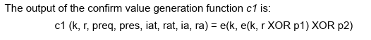

# Crackle

##### By Mike Ryan

Tool presented by Mike Ryan used to exploit weakness in Legace LE Pairing. This short excerpt expects that the reader is familiar with LE Pairing procedure described in the `pairing.md` document.

The attack presented is passive eavesdropping on communication between two bluetooth devices that were paired using LE legacy pairing procedure. The attack can be delivered offline, once the data capture is complete, or online. Once the link key is cracked, any future communication between the two devices can be decrypted (until they explicitly change the link key).  

Attacker needs to successfully capture whole pairing process to gain posession of all necessary values that are used to compute the `STK`. The attacker is then left to brute-force the relatively small key space (0 - 999999). 

#### Attack

The link key `STK` is in LE Legacy pairing computed from `TK`, the temporary key and two random values that are sent in plain text. Thus, for attacker, knowledge of `TK` together with the communication capture is enough to compute the link key `STK`  and use it to decrypt the subsequent communication. Let's show how to extract the `TK` from captured pairing. 

Successful pairing capture will certainly contain the confirm values `Sconfirm` and `Mconfirm`, which are computed from known values and `TK` as depicted on the image.

_Image taken from spec v5.1, Vol 3, Part H, Section 2._

The c1 function has a lot of paramaters, but all of them except `k` = `TK` are sent in plaintext during the procedure. The `e` function for LE Legacy Pairing is 128-bit AES, so this is also well known. Since there are only 1 000 000 possible values for `TK` (0-999999), attacker can easily compute hypothetical confirm values for all possible `TK`s and simply determine the correct value based on which hypothesis matches captured confirm value. 

The attacker can then compute `STK` from `TK` and captured `Srand` and `Mrand` to obtain the link key and be able to decrypt all the following communication. 

#### Remark

This attack only works if the whole pairing process is captured by the attacker. If he misses one of the values used in computation, he won't be able to recover the `TK`.  
