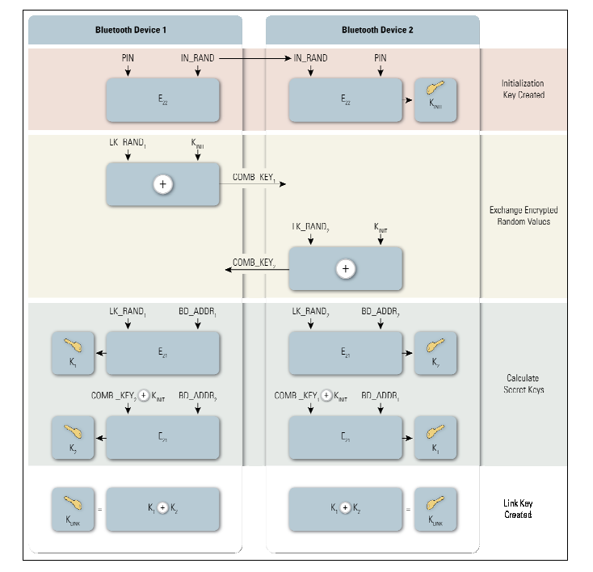

## Bluetooth Essentials

probably only `BR/EDR` here? or how to include `BLE`

#### Frequency hopping

Bluetooth operates in 2.4 to 2.4835 `GHz` radio frequency band. Employs `FHSS`(Frequency hopping spread spectrum) which reduces transmission errors and also provides limited security. This means bluetooth devices hop between `79` different channels when communicating. The hop is determined by pseudo-random sequence. This feature is one of the causes that make eavesdropping on bluetooth communications rather difficult. 

#### Discoverable and Connectable Modes

For connection establishment, bluetooth devices use specific __discoverable__ and __connectable__ modes.

Device in __discoverable__ mode periodically listens on inquiry scan physical channel and responds to inquiry on this channel with `BD_ADDR`, local clock and other characteristics needed for connection establishment. 

Device in __connectable__ mode periodically listens on page scan physical channel and responds to page on that channel to initiate a network connection. The page scan physical channel frequency is determined based on the device `BD_ADDR`.

These are described by inquiry and connection procedures.

### Architecture

Bluetooth has its own protocol stack, which spans through all the known layers of `ISO/OSI` model. 

The most common form of bluetooth connection is ad-hoc network, created between master and a slave. Reason for this is that Bluetooth makes it fairly simple to establish a wireless connection between two close devices. Bluetooth connections are established as so called piconets. Piconet can consist of 1 master and up to 7 slaves. In practice, this can be a connection formed e.g. between Laptop and a Mobile phone. 

Usual bluetooth device consists of `Host` and `Controller`. `Host` is the device itself and is responsible for the implementation of higher layers of protocol stack. `Controller` is responsible for the `PHY` and `link` layers. `Host` and `Controller` communicate with each other via `HCI` (Host Controller Interface). In practice, `Host` could be a laptop and `Controller` its integrated bluetooth module or `USB` bluetooth dongle. Host instruments the controller via `HCI`.  

### Protocols

### HCI

### Paging process

BR/EDR Controller Volume. Part B baseband specification. 8 Link Controller Operation

### Security Features

Bluetooth provides security mechanisms to achive _Authentication_, _Authorization_ and _Confidentiality_ 

#### Security Modes

Each bluetooth device operates in one of 4 security modes defined below.

##### Security Mode 1

No security functionality applied, only supported in `+EDR` v2.0 and earlier devices. 

##### Security Mode 2

Service-level  enforced security mode. The procedures are initiated after the `LMP` link was established, but before the `L2CAP` link establishment. Security Manager employs access control. _Authentication_ and _Encryption_  are provided by `LMP` layer. Bluetooth devices `+EDR` v2.1 only support this mode for backward compatibility.

##### Security Mode 3

In this mode the devices employ security services before the physical link is fully established. _Authentication_ and _Encryption_ are based on secret link key.This key was established during pairing process.  Only in `+EDR` v2.0 devices.

##### Security Mode 4

New method, introduced in `+EDR` v2.1. `SSP` (Secure Simple Pairing) uses `ECDH` key exchange, _authentication_ and _encryption_ remain the same as in previous modes. Mandatory for communication between `+EDR` v2.1 devices.

#### Link Key Generation

Link key generation is different for modes 2,3 than for mode 4. 

##### For Modes 2,3

This method requires users to enter identical PIN into devices. Or just one, depending on the configuration. The link key generation procedure is depicted on the following figure.

##### For Mode 4

`Secure Simple Pairing` introduced in `+EDR` v2.1. This simplifies the pairing process and makes it cryptographically resistent agains passive eavesdropping and MitM attacks thanks to `ECDH`. 

Comprises of 4 association models. None of the values used in association is used in subsequent key generation. The models are devised for different capabilities of devices that are being paired. Based on which association model is used, the connection link is either `authenticated` (Numeric Comparison, Passkey Entry, OOB) or `unauthenticated` (JustWorks). Association model is chosen based on the I/O capabilities of the devices

#### Encryption

haven't properly looked into this yet, but uses secure algorithms 

.. more

### BlueZ Linux Stack

#### `hcitool`

#### `sdptool`

### References

`NIST Guide to Bluetooth security`
