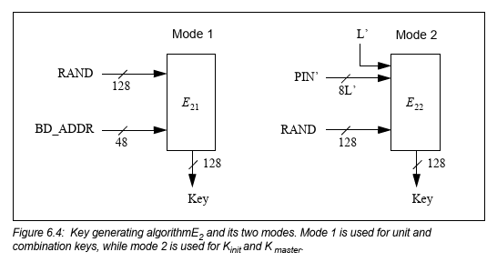
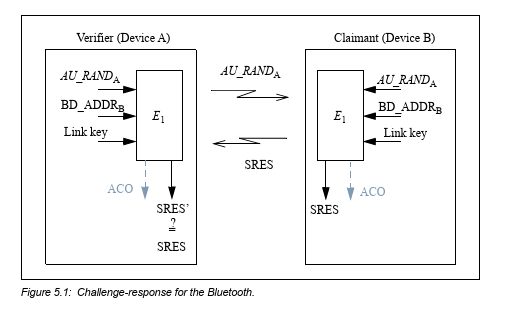
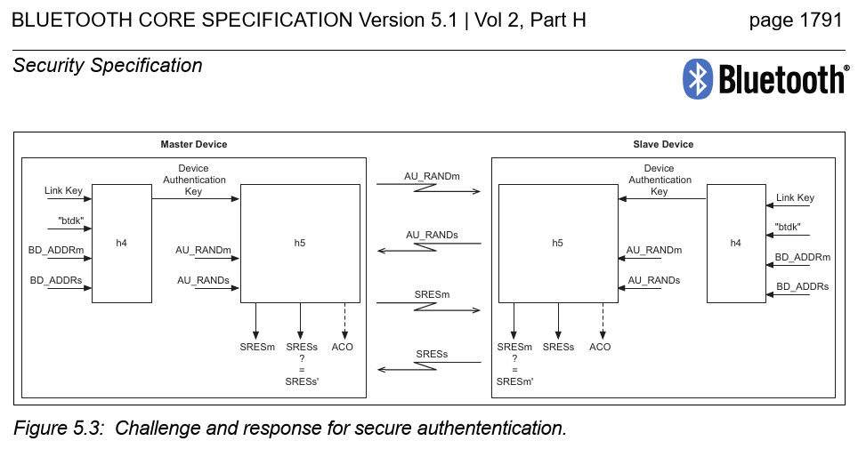
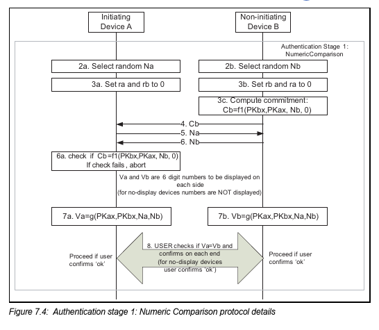
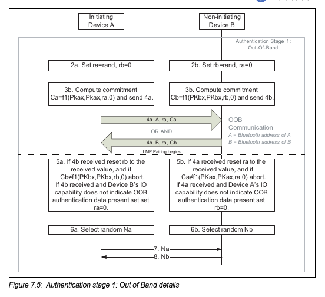
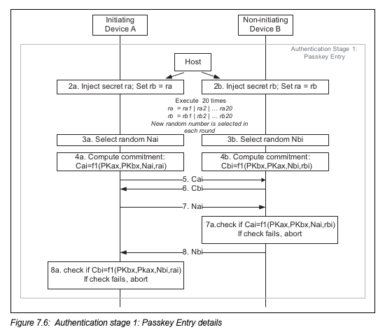
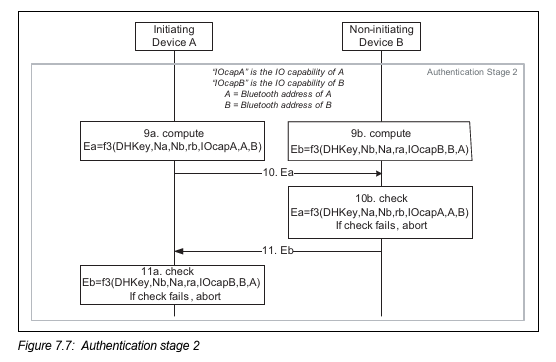
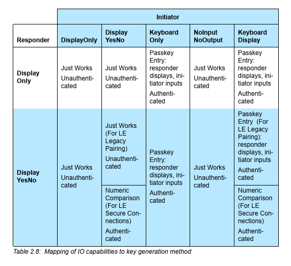

# Pairing

Brief explanation of Bluetooth pairing process. This document covers both classical (`BR/EDR`) bluetooth and `BLE` pairing mechanism. And as well as legacy pairing schemes, which were shown to be broken, description of security-enhanced Secure Simple Pairing is provided. 

Pairing of Bluetooth devices is a process of establishing _link key_ that will be used for subsequent authentication and encryption.

## Classical (BR/EDR)

Legacy pairing procedure described in _specification Core-v5.1, Vol 2, Parts C.4,H_. These parts cover Link layer's point of view on pairing. Security Modes and further mechanisms are described in _spec Core-v5.1, Vol 3, Part C.5, Generic Access Profile_. 

Generally, the classical pairing process consists of 3 phases:

* K_init creation - initial key, used to encrypt the messages that carry information needed for the K_AB computation - the link key

* K_AB establishment 

* Authentication (and optionally encryption)

In case the link (K_AB) key has been previously established, only the authentication procedure takes place.

### K_init - initialization key creation

_Mainly from spec v5.1, Vol 2, Part H.3.2.1 and Vol 2, Part C.4.2.2_

The goal of this phase is to establish initialization key, which is temporarily used to encrypt messages used to establish long term link key.

In this process, one of the devices is referred to as initiator of the pairing, the second one is responder.

First, the initiator of the pairing generates random number `RAND` and sends it in `LMP_in_rand` PDU to responder. This message is not encrypted. The `RAND` value is used together with `PIN` and `L` values as inputs to `E22`(E2 function, mode `2`) function. Output of this function is`128-bit` initialization key. This computation is performed in both devices.

`PIN` can be either fixed for a given device, or obtained as user input (user inputs the same `PIN` into both devices). This depends on the `I/O` capabilities of the devices. The `PIN` value is further augmented by `BD_ADDR` value (I decided to leave out the details of this augmentation here). Whenever one of the devices uses fixed `PIN`, the `BD_ADDR` of the opposing device is used for this augmentation. In case both devices use fixed `PIN`, they cannot be paired.  The `L` value is length of `PIN` in octets.

_image is taken from the specification Core-v5.1, Vol 2, Part H, Page 1798_

### K_AB - link key creation

*Mainly from spec v5.1, Vol 2, Part H.3.2.4 and Vol 2, Part C.4.2.2*

After the initialization key has been computed, device A generates random number `LK_RAND-A` and device B generates random number `LK_RAND-B`. 

Both parties shall then encrypt their values by `XOR`ing them with the mutual initialization key established in previous phase. And then shall send these values to each other in `LMP_comb_key` PDU. So now device A holds both `LK_RAND-A` and `LK_RAND-B` and so does device B.

Both devices will then compute combination key K_AB as follows:

$ LK\_K_A = E_{21}(LK\_RAND_A, BD\_ADDR_A)$ 
$ LK\_K_B = E_{21}(LK\_RAND_B, BD\_ADDR_B)$
$ K_{AB} = LK\_K_A \oplus LK\_K_B $

Where the function `E21` is as defined in _spec v5.1, Vol 2, Part H, Section 6._ And shown on diagram above. 
The combination key K_AB is now the created link key for devices A and B and the initialization key is discarded.

After the link key is established, the devices should perform `mutual authentication` to make sure the same correct link key was created at both devices.  

In `BR/EDR`, pairing process may occur during the _Link setup_ (GAP Security Mode 3), or right after _Link setup_ completion.

### Authentication

Bluetooth specification defines two authentication procedures. First, _legacy authentication_, is used if one of the devices lacks Host or Controller support for the Secure Connections. If both devices have all support for Secure Connections, _secure authentication_ procedure is used.

##### Legacy Authentication

Legacy authentication procedure is a single challenge-response message exchange. Verifier (can be either Master or Slave) sends `AU_RAND` value to the Claimant, who computes a value dependent on previously established link key, received `AU_RAND`, and `BD_ADDR` and sends it back to Verifier. The Verifier then checks if the computed values match. This is depicted below.

_The image is taken from spec v5.1, Vol 2, Part H, Section 5. E1 function is defined in Section 6_. 

Some applications require mutual authentication. In this case, after A successfully authenticates B, the process can repeat with roles between A and B exchanged. 

##### Secure Authentication

Secure authentication is always mutual. This means, after secure authentication process, both parties are authenticated towards other party. 

Procedure begins with Master sending random number `AU_RAND-master` to slave and Slave sending `AU_RAND-slave` to master. Then both parties compute responses and exchange these. Both parties then authenticate each other. Diagram will follow.

_Image taken from spec v5.1, Vol 2, Part H, Section 5, Functions h4 and h5 are defined in Section 6_

### Secure Simple Pairing

Procedure described in _spec v5.1 Vol 2, Part C, Section 4.2.7_ and  _spec v5.1 Vol 2, Part H, Section 7_.  

Secure Simple Pairing (`SSP`)consists of 5 sub-phases:

* Public Key exchange

* Authentication stage 1 

* Authentication stage 2

* Link key calculation

* LMP Authentication and Encryption

The first 4 phases are secure alternative to legacy pairing mechanism - link key establishment, the 5th stage (after the link key is established) remains the same.  

#### Public Key exchange

Devices exchange their `ECDH` public keys generated beforehand. If both Hosts and Controllers support `Secure Connections`, P-256 elliptic curve is used. Otherwise P-192 elliptic curve has to be used. 

#### Authentication stage 1

`SSP` uses three association models: _Numeric Comparison_, _Passkey Entry_, _Out of band_. To determine which of these models will be used, the initiator needs to know the `I/O` capabilities of the other communication party. This exchange occurs on Link Manager `LM` protocol layer even before the `Public Key exchange` phase.  By `I/O` capabilities we understand e.g. the ability of device to display numbers, or the ability to input numerical values.

##### Numeric Comparison

In this model, values computed by both devices are checked for match by the user when pairing two devices. As shown below, these `Va` and `Vb` are computed from random values and public keys exchanged in the previous phase. Of a high importance here is the commitment computed.    

Diagram will follow.

_Image is taken from spec v5.1, Vol 2, Part H, Section 7_

Important to note: `Na` and `Nb` need to be truly random and fresh for each pairing. 

##### Out of Band (OOB)

In this model, devices exchange parameters (commitment, random number and address) in out of band channel (e.g NFC technology). The procedure is depicted on diagram below. 

*Image is taken from spec v5.1, Vol 2, Part H, Section 7*

Mike Ryan claims it is not used in practice.

##### Passkey Entry

From user's point of view, either the same passkey is entered to both devices, or it is generated and displayed on one device and user enters it into the second one. 6-digit passkey is expected, if shorter, the provided value is preceeded with zeroes (1234 -> 001234). 

In the following diagram, the passkey is referred to as `ra` and `rb`. Commitments are computed and checked in 20 rounds (one for each passkey bit). In each round, in case the commitment check fails, procedure is aborted.  

*Image is taken from spec v5.1, Vol 2, Part H, Section 7*

#### Authentication stage 2

The second authentication stage is just a confirmation that both devices completed the exchange successfully. Again, computation of two values from `I/O` capabilities, `BD_ADDR`, and the randomness recycled from the last round of stage 1 is performed on both devices, exchange and match check. Again, diagram with details from specification will follow. 

*Image is taken from spec v5.1, Vol 2, Part H, Section 7*

#### Link Key calculation

At this point both sides compute their link key from `DHKey`(The mutual Diffie-Hellman key) and publicly exchanged parameters, so that the link key can be freshly regenerated in case it is needed.

#### LMP Authentication and Encryption

These procedures are identical to their corresponding procedures in legacy pairing. 

## Bluetooth Low Energy (BLE)

_spec v5.1, Vol 3 Part H, Section 2_

The Pairing procedure for `BLE` over `LE` physical layer is fairly similar to `BR/EDR` part (especially the secure way is pretty much the same as `SSP`). However, there are some minor and structural differences. One of these is that the whole process is executed by `SM` (Security Manager), which operates on Host, opposed to `LM` which takes care of `BR/EDR` pairing and operates on Controller. 

The paring can be again divided into three phases:

1. Pairing Feature Exchange

2. Short Term Key (STK) generation (in LE legacy pairing) or Long Term Key (LTK) generation (in LE Secure Connections)

3. Transport Specific key distribution

### Pairing Feature Exchange

The Pairing starts with exchange of I/O Capabilities, OOB authentication data availability, authentication requirements (explained at _spec v5.1, Vol 3, Part H, Section 3.5.1_) of both parties and key sizes. 

Information exchanged at this phase determines which method will be used in phase 2 and if the pairing between the devices is possible.

### Key Generation

The way this phase is carried out is determined based on the information exchanged in the previous phase. In the first place, the devices need to determine if LE Secure Connections Pairing can be used. That is, if both devices support the procedure. If not, the LE Legacy Pairing needs to carry on. There are four key generation methods for each of the mentioned pairing mechanisms (Legacy vs. Secure Connections):

* Just Works

* Numeric Comparison

* Passkey Entry

* Out Of Band

The choice of the method depends on the authentication requirements and I/O Capabilities. The effect of I/O capabilities is determined by the _table 2.8_. Part of this table is depicted on image below, the full version can be found in the _spec v5.1, Vol 3, Part H, Section 2, Table 2.8_

In the following sections, each of the methods for each of the mechanism will be described.

### LE Legacy Pairing

After the key generation method is determined from all the parameters, one of the three following methods (Numeric Comparison method is not used in legacy key generation) is used to generate `TK` which is then further used to generate `STK`

#### Legacy Temporary Key Generation (Phase 1)

##### Just Works

The `TK` value is set to `0` in both devices. 

##### Passkey Entry

This method uses 6-digit `PIN` that user enters into both devices as `TK`. In case one of the devices does not have input capabilities, but can display digits, there is an alternative. In this alternative, one of the device generates random 6-digit number, displays it, and the user then enters this number to the second device. This value is further used as `TK`. Since `TK` is 128-bit value, it is padded with zeroes.

##### Out of Band

The 128-bit `TK` value is  transferred in out of band channel. 

#### `STK` Computation (Phase 2)

Initiating device generates 128-bit random number `Mrand`and uses it to compute value `Mconfirm`. This value is computed with `TK`, `Mrand` and a bunch of other values (e.g. pairing response commands, `BD_ADDR` of both devices) with function `c1` defined in _spec v5.1, Vol 3, Part H, Section 2.2.3_. 

Responding device then generates `Srand` and computes `Sconfirm` in similar fashion. 

Devices then go on to exchange first the confirm values and then the random values. Both parties shall then compute the confirm values of the other party and check if they match. This is a way to ensure that the other party has correct `TK` value.   

`STK` is then calculated with function `s1` defined in _spec v5.1 Vol 3, Part H, Section 2.2.4_

$ STK = s1(TK,Srand, Mrand)$

### LE Secure Connections Pairing

LE Secure Connections pairing is carried out in the same way as Secure Simple Pairing. ECDH public exchange, authentication phase 1, phase 2 and then `LTK` generation. 

For security manager debug mode, a hardcoded private/public key pair is defined in _spec_.

### Specific Key Distribution

After the key is established, again the encryption can be set up. Besides encryption, LE devices support digital signing of the sent data. 
