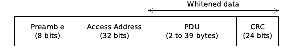

# Paper Summary

#### Bluetooth: With Low Energy comes Low Security

##### By Mike Ryan

### Introduction

In this paper, Ryan briefly explains how `BLE` operates, explains the constraints for sniffing of `BLE` traffic and its ease in comparison to regular (`BR/EDR`) Bluetooth communications. Then explains how they built a working `BLE` Sniffer on top of Ubertooth and how he can use this sniffer to inject packets. They have successfully built a sniffer that is also able to sniff communications that were not captured from the beginning. Meaning, the connection setup is not present, so further parameters had to be recovered. In the major section an attack on `BLE` key exchange mechanism (`pairing`) is presented. 

### Bluetooth Low Energy

This section briefly introduces the technology aspects of BLE needed to understand the paper. The difference between `BLE` and `BR/EDR` is in `PHY` and `link` layers. `BLE` uses the 2.4 GHz spectrum in the following way. The spectrum is splitted into 40 channels (as opposed to 79 in `BR/EDR`). Out of these 40, 37 channels are used as data channels and 3 are dedicated to connection setup communication. So called advertising channels. These are used by the devices that are not yet connected to broadcast information and establish connections. 

##### Packet Structure

The packet always contains `Preamble`, followed by `32-bit` __Access Address__, this is `0x8e89bed6` for packets in advertising packets, or value negotiated during connection setup for data packets. Next on, `PDU` contains the actual data and is at least 2 bytes long. These two bytes, used as a header are further used to recover the __Access Adress__ when sniffing. As explained later.  `CRC` is computed by `LFSR` seeded with value that is negotiated during connection setup.

### Eavesdropping

`BLE` communications sequentially hop from channel to channel by predefined sequence. This sequence is fully determined by `HopInterval` and `HopIncrement` parameters. Additionally, `Access Address` and ` CRCInit` values need to be determined to successfully snif on a single connection.

In the rest of this section, `Ubertooth` is briefly introduced and its translation from RF to bytes. 

#### Following Connections

The hopping sequence for `BLE` connection is as follows:
`nextChannel = channel + HopIncrement (mod 37)` 

On each channel, both master and slave send exactly one packet and then hop to another channel. In case no data needs to be exchanged, empty packet is sent. Therefore, the sniffer needs to hop along the channels together with the master and the slave of the connection that we are eavesdropping on. 

### Parameter Determination

#### Access Address

Technique used to determine the `Access Adress` of an ongoing communication is as follows. The sniffer begins to sniff one arbitrary channel and looks for empty data packets. These have predictable form. Originally, the data portion of the packet consists of `16-bit` header and `0-37` bytes of data. Since no data is trasmitted in empty packet, it only contains header followed by `CRC`. Moreover, `14/16` of header bits are constant zeroes. The sniffer analyzes the captured bitstream looking for these header bits. These are immediatly preceeded by the `Access Address`, so this can be recovered. Note that false positives occur, since only `14` bits are compared. This is solved by accumulating 5 same candidate before it is announced the winner. 

#### CRCInit

`CRC` is calculated with reversible `LFSR`. Thanks to its reversibility, we can reconstruct `CRCInit` of a single connection from several candidates captured on the air. Again, false positives. 

#### Hopping Parameters

### Encryption Bypass

need for the whole key exchange process explanation?

### Future Work

In future work proposals, Ryan mentions man in the middle attack as an extension of proposed attacks, there is also a space for practically  implementing the theoretical attack to force a key renegotiation. Last but not least, he proposes work on stack fuzzers and states there is a great probability of memory corruption in bluetooth stack implementations. 

### References

`crackle` http://lacklustre.net/projects/crackle/ - tool built to implement the key attack on key exchange

,

,

,

,,,,

,,

,

,

,

,

,

,
